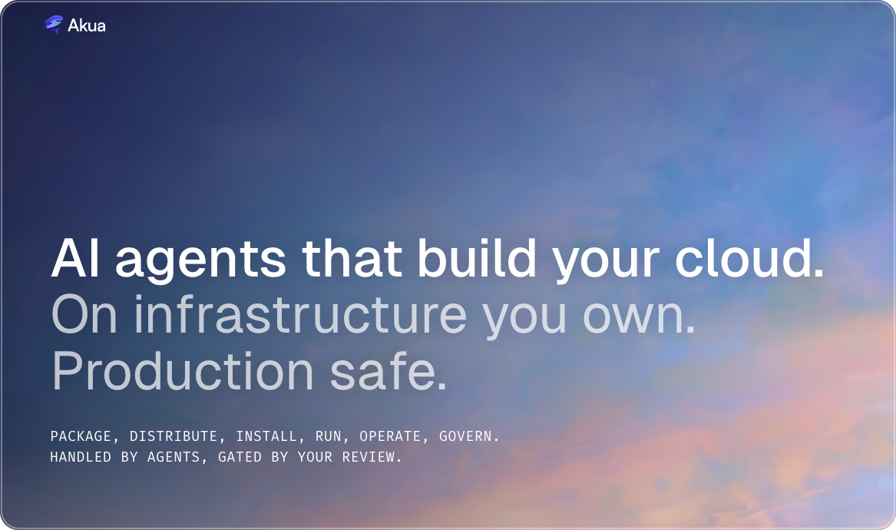

<!-- markdownlint-disable MD033 MD041 -->

  

  <a href="https://akua.dev">Website</a>
  ·
  <a href="https://docs.akua.dev">Docs</a>
  ·
  <a href="https://docs.akua.dev/quickstart">Quickstart</a>
  ·
  <a href="https://docs.akua.dev/ai">AI &amp; Agents</a>

Akua is a cloud-native application platform for agents and teams. Connect an
agent, deploy applications, manage infrastructure, and package cloud-native
software from one workspace.

## Start Building

- [Quickstart](https://docs.akua.dev/quickstart) - create an account, connect an
  agent, and start from workspace context.
- [Docs](https://docs.akua.dev) - learn the platform concepts and workflows.
- [AI & Agents](https://docs.akua.dev/ai) - connect external AI tools through
  MCP or use hosted agents in the dashboard.
- [Bring your own cloud](https://docs.akua.dev/platform/byoc) - understand how
  Akua works with infrastructure you own.

## What You Can Build

- Agentic operations with controlled infrastructure and deployment changes.
- Managed or imported Kubernetes clusters, workers, and regions.
- Reusable packages from Helm, Kustomize, and composed sources.
- Application installs, renders, customization, versions, and updates.
- Products and Offers for checkout-ready cloud-native installs.

## Built For

- **Platform teams** giving agents a controlled way to prepare infrastructure and
  deploy software.
- **Software vendors** shipping cloud-native products into customer-owned or
  managed environments.
- **Infrastructure operators** keeping ownership of cloud accounts, regions,
  workers, secrets, and approval boundaries.
