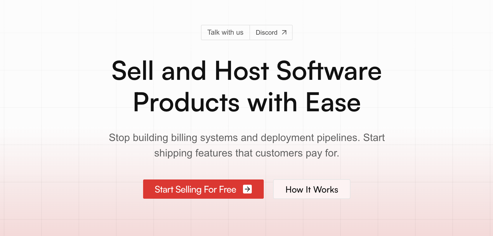
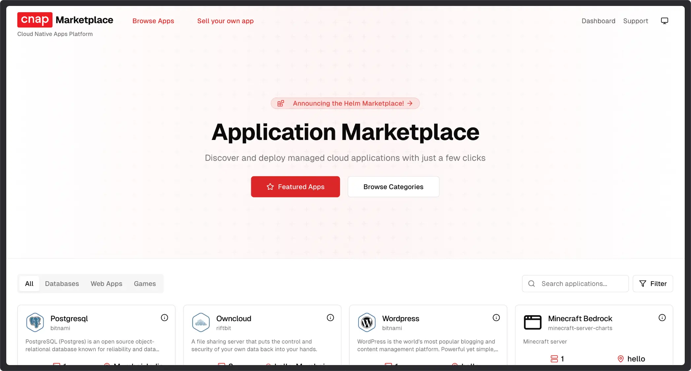

<h1 align="center">CNAP — Sell and Host Software Products!</h1>

 

  <em>Turn code projects into managed cloud services</em>  

  <strong>CNAP</strong> automates the deployment, management, and monetization of cloud-native applications 
  with built-in infrastructure operations, billing, and multi-tenancy.

 

  
  &nbsp;
  

 

 

 CNAP is a platform that converts applications into managed cloud services. It handles Kubernetes cluster management, automated billing, and customer deployment workflows, enabling developers to focus on application development rather than infrastructure operations.

 

## ‎ ‎ Getting Started

**For Developers:**

- **Quickstart**: [docs.cnap.tech/quickstart](https://docs.cnap.tech/quickstart)
- **API Reference**: [docs.cnap.tech/api](https://docs.cnap.tech/api)

**For Platform Evaluation:**

- **Demo Environment**: [dev.cnap.tech](https://dev.cnap.tech)
- **Contact**: [robin@cnap.tech](mailto:robin@cnap.tech)

## ‎ ‎ Problem

Converting code projects to managed services requires significant infrastructure investment:

- **Infrastructure Complexity**: Setting up multi-tenant Kubernetes, monitoring, scaling, and security
- **Billing Integration**: Implementing usage tracking, invoicing, and payment processing
- **Operational Overhead**: 24/7 monitoring, customer support, and maintenance
- **Time to Market**: 6-12 months of engineering effort before first customer deployment

This creates a barrier for developers wanting to monetize their software and limits the number of managed service offerings in the market.

Longer version

Development teams, agencies, DevOps professionals, and enterprises frequently struggle with the **complexity, 
time-consumption, and inconsistency** of deploying and managing cloud-native applications across various 
environments. Many successful open-source projects **fail to generate revenue effectively** because converting 
them to managed offerings takes significant engineering effort and extensive cloud expertise. This leads to:
- Slower time-to-market for new applications and features.
- Inefficient use of developer time on operational tasks.
- Challenges in scaling operations and managing private clouds.

## ‎ ‎ Solution

CNAP provides the infrastructure layer for managed services:

- **Rapid Go-to-Market**: Turn your code projects into fully managed cloud services with minimal setup and 
operational overhead.
- **Kubernetes as a Service**: Automated cluster provisioning, scaling, and maintenance
- **Multi-tenant Architecture**: Isolated customer environments with resource controls
- **Integrated Billing**: Stripe integration with usage metering and automated invoicing
- **Deployment Automation**: Helm-based application packaging and one-click/on-checkout customer deployments

## ‎ ‎ How It Works

### For Application Providers

1.  **Package Application**: Convert existing applications to Helm charts or import from Artifact Hub
2.  **Configure Pricing**: Set usage-based or subscription pricing models via Stripe integration
3.  **Deploy**: Customers can buy applications in their chosen regions with automated provisioning

### For Platform Operators

1. **Cluster Management**: Create new clusters or import existing Kubernetes clusters (EKS, GKE, AKS, self-managed)
2. **Application Marketplace**: Import Helm charts and configure application offerings
3. **Customer Management**: Handle deployments, billing, and resource allocation across multiple customers

 

## ‎ ‎ Technical Features

- **Multi-tenant Isolation**: Per-customer clusters or dedicated namespaces with network policies
- **Vendor Neutrality**: Deploy on cost-effective CNAP-managed clusters or bring your own Kubernetes (EKS, GKE, AKS, self-managed, bare metal)
- **Automated Scaling**: Horizontal pod autoscaling and cluster autoscaling based on resource usage
- **Monitoring & Observability**: Prometheus, Grafana, and logging integration with per-customer dashboards
- **CI/CD Integration**: GitOps workflows and automated application updates
- **API-First**: REST API for all platform operations and integrations

## ‎ ‎ Target Market

**Primary Users:**

- **SaaS Developers** converting code projects into managed offerings
- **Software Vendors** needing customer-isolated deployments for compliance
- **Service Providers** managing multiple customer environments
- **Startups** requiring rapid go-to-market for cloud services

**Market Segments:**

- Regulated industries requiring data isolation (healthcare, finance, government)
- B2B software requiring customer-specific deployments
- Open-source projects seeking monetization paths

 

[‎](https://dash.cnap.tech)

---

Built with open-source technologies. Learn more about the [CNCF ecosystem](https://landscape.cncf.io/).

<!--
Made with ☁️ by the CNAP team
-->
